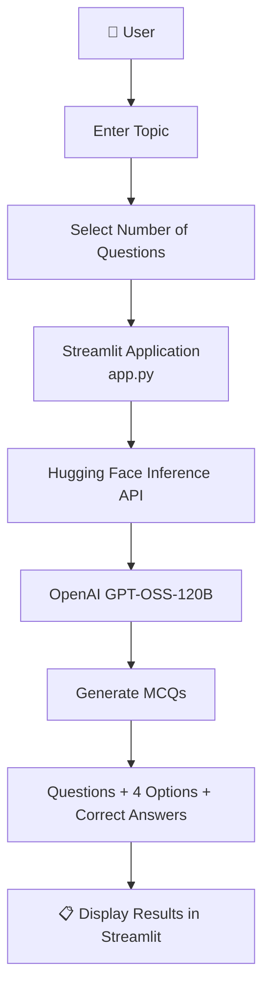

# MCQ Generator

This is an AI-based MCQ Generator project made using Python, Streamlit, and Hugging Face.

It helps users generate multiple-choice questions by entering a topic and selecting the number of questions they want.

## Features

* Generate MCQs using AI
* Choose the number of questions
* Get four options for each question
* Display the correct answers
* Simple and easy-to-use interface

## Technologies Used

* Python
* Streamlit
* Hugging Face
* Model=OpenAI GPT-OSS-120B
```
Project Structure
MCQ-Generator/
│
├── app.py
├── requirements.txt
├── README.md
│
└── .streamlit/
    └── secrets.toml
```
## 🔄 Workflow




## How to Run

```bash
pip install streamlit huggingface_hub
```

```bash
streamlit run app.py
```

## How It Works
The user enters a topic in the input field.
The user selects the desired number of questions.
The application sends the topic and quiz requirements to the Hugging Face inference API.
The Large Language Model generates the requested multiple-choice questions.
The generated questions, options, and correct answers are displayed in the application.

## Installation and Setup

```
1. Clone the Repository
git clone https://github.com/srudhyasankaranarayanan/MCQ-Generator.git

2. Navigate to the Project Directory
cd MCQ-Generator

3. Install Dependencies
pip install -r requirements.txt

4. Configure the Hugging Face API Token

Create a file named secrets.toml inside the .streamlit folder.

Access_Token = "your_huggingface_access_token"

Keep your API token private and do not upload secrets.toml to GitHub.

5. Run the Application
streamlit run app.py

The application will open in your browser.
```
## Example Usage
Input

Topic:

Artificial Intelligence

Number of Questions:

5
Output

The application generates five multiple-choice questions related to Artificial Intelligence, with four options and the correct answer for each question.

## Use Cases
Student examination preparation
Self-learning and practice quizzes
Educational content generation
Classroom assessments
Technical interview preparation
Subject-wise knowledge testing

## Future Improvements

* Add quiz scoring
* Add difficulty levels
* Download questions as PDF
* Model name: **openai/gpt-oss-120b**

## Purpose

This project helps students practice different topics and improve their knowledge using AI.

## Author
 **Srudhya Sankaranarayanan** 
